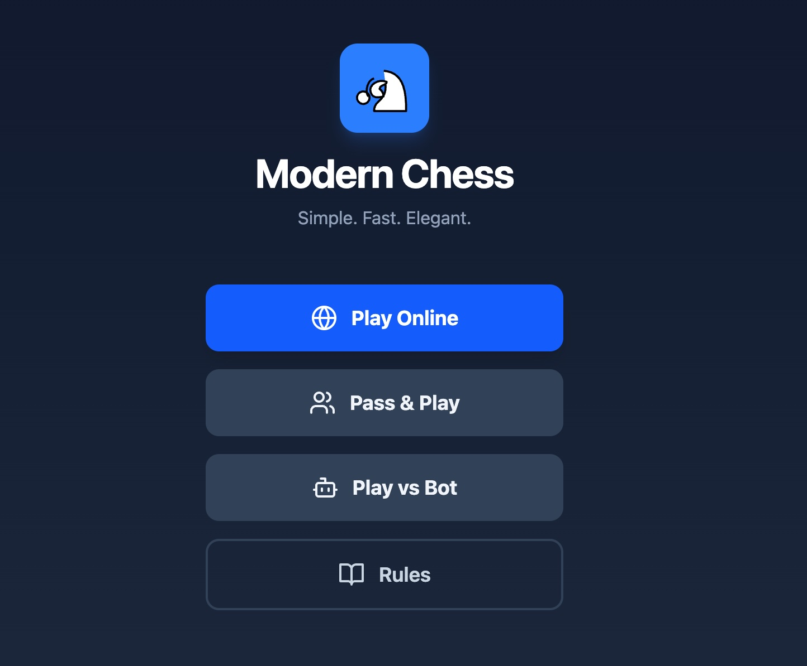

# Modern Chess

Modern Chess is a sleek, mobile-first chess experience with local, bot, and online play.
It pairs a clean UI with a simple AI and Firebase-backed matchmaking.

## Screenshots



## Features

- Pass & play on a single device.
- Play vs bot with adjustable difficulty (minimax).
- Online games with shareable 6-character codes.
- Draw offers, resign, promotions, and game-over modals.
- Move list, captured pieces, and score advantage indicators.
- Subtle sound feedback on moves.

## Tech Stack

- React + TypeScript + Vite
- Tailwind CSS
- chess.js
- Firebase Auth + Firestore (optional, for online play)

## Getting Started

Install dependencies and start the dev server:

```bash
npm install
npm run dev
```

Build and preview:

```bash
npm run build
npm run preview
```

Lint:

```bash
npm run lint
```

## Online Play (Firebase)

Online games use Firebase Auth (anonymous) and Firestore. Add a `.env.local` with:

```bash
VITE_FIREBASE_API_KEY=...
VITE_FIREBASE_AUTH_DOMAIN=...
VITE_FIREBASE_PROJECT_ID=...
VITE_FIREBASE_STORAGE_BUCKET=...
VITE_FIREBASE_MESSAGING_SENDER_ID=...
VITE_FIREBASE_APP_ID=...
VITE_APP_ID=modern-chess
```

Notes:
- Online play is automatically disabled if Firebase variables are missing.
- The Firestore rules in `firestore.rules` are scoped to authenticated players, but should still be reviewed for production use.

## Project Structure

- `src/components/views`: Home, Rules, Online menu, and Game screens.
- `src/engine`: Bot evaluation and minimax logic.
- `src/config/firebase.ts`: Firebase initialization and helpers.
- `src/utils/sound.ts`: Sound effects for moves.

## Contributing

1. Create a feature branch.
2. Run `npm run lint` before opening a PR.
3. Include a short description of changes and any relevant screenshots.
```
